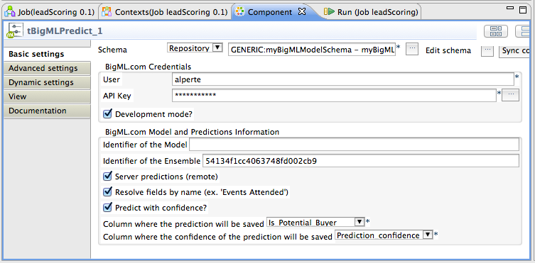

tBigMLPredict
=============

In this project you find a Talend Open Studio component that you can use to make calls to the [predictions service of BigML.io](https://bigml.com/developers/predictions) using the [Java Bindings](https://github.com/bigmlcom/bigml-java).

You can use it to easily make, once installed in TOS, remote and local predictions using predictive models defined in [BigML.com](https://bigml.com)

## Supported Algorithms

- Model. With local and remote predictions.
- Ensemble. With local and remote predictions.
- Logistic Regression. Only remote predictions are available.

NOTE: The Java Bindings doesn't has yet support for local Logistic Regression.

## TOS-Configuration

These are the configuration parameters you could use to define the behaviour of the component once the component is installed in TOS:

* The **Schema** we are going to use to send the input fields of the prediction and save the prediction response
* The **User** and **Api KEY** used to connect to the BigML.io account
* The **Model Id** or **Ensemble Id** on the server that will be used to make predictions
* If we are doing requests in **Developer Mode?** or not
* If we want to do local or **Server predictions (remote)**
* If we want to **Resolve fields by name** or code (ie. "Is Potential Buyer" or "1000b2")
* If we want to **Predict with confidence** or not
* The column of the schema where we want to save the predicted value
* The column of the schema where we want to save the confidence of the prediction

## Support

Please, report problems and bugs to [BigML.io-TOS issue tracker](https://github.com/javinp/bigml-talend-components/issues)

Discussions about the different bindings take place in the general [BigML mailing list](http://groups.google.com/group/bigml). Or join us in [Campfire chatroom](https://bigmlinc.campfirenow.com/f20a0)

## Build the component

The project uses Maven as project manager.

To build the component, open a command line in the component basedir  and give:

    mvn clean install

This will package the component and copy it in your TOS custom components folder (default to $HOME$/talend_components)

If you want to specify a different custom component location, issue the command:

     mvn clean install -DcomponentsFolder=/path/to/your/tos_custom_components

If you want to package the component in the basedire but **not** deploy it in custom component folder, issue the command:

    mvn clean package

## Command-line parameters
You can set some parameters in command-line using the -D flag. Here's a list:

* **skipTests** (default: true) to skip/unskip the test phase
* **addMavenDescription** (default: true) to add/cut the META-INF/maven stuff in client JAR
* **dependencyVersion** (default: true) to add/cut the version number suffix to all external dependencies
* **useSnapshot** (default: true) to use or not snaphsot releases in all external dependencies
* **componentsFolder** (default: $HOME$/talend_components) path to your installation TOS custom component folder   

## External Dependencies

* Talend Bridge Api, from Gabriele Baldassarre
* Json Simple, from Yidong Fang

## Greetings

- Thanks to Gabriele Baldassarre and his article about [How to use Maven in Talend component development](http://gabrielebaldassarre.com/2012/11/05/how-to-use-maven-in-talend-component-development/), it helped us alot during the development of the component. There is little quality information about developing components in Talend out there, which is why initiatives such as this are really valuable. Thanks Grabriele!

